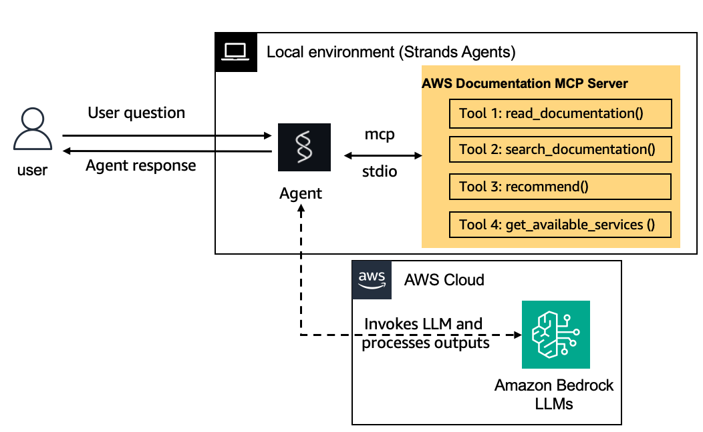

# AWS Documentation Agent

An intelligent AWS documentation assistant powered by Amazon Bedrock AgentCore. This agent helps users find accurate, up-to-date information from AWS documentation using natural language queries.


## Introduction

The AWS Documentation Agent leverages the AWS Documentation MCP (Model Context Protocol) server to provide intelligent responses about AWS services, features, and best practices. It can search through AWS documentation, answer questions about AWS concepts, and guide users to relevant documentation sections.

## Prerequisites

Before deploying the agent, ensure you have:

- **Python 3.8+** installed
- **uv** package manager installed ([installation guide](https://docs.astral.sh/uv/getting-started/installation/))
- **AWS CLI** configured with appropriate credentials
- **AWS Bedrock AgentCore access** with necessary permissions
- **Docker** installed (for containerized deployments)

## Installation

1. Clone or download this repository
2. Install dependencies:
   ```bash
   uv sync
   ```

## Deployment



Deploy the agent using the deploy script:

```bash
# Deploy with CodeBuild (recommended)
uv run scripts/deploy.py aws_docs_agent

# Deploy without CodeBuild
uv run scripts/deploy.py aws_docs_agent --no-codebuild
```


## Usage

### Invoke the Agent

Once deployed, you can invoke the agent with questions:

```bash
# Ask about AWS services
uv run scripts/invoke.py aws_docs_agent "What is Amazon S3?"

# Get specific configuration help
uv run scripts/invoke.py aws_docs_agent "How do I configure VPC endpoints for S3?"

# Ask about best practices
uv run scripts/invoke.py aws_docs_agent "What are the security best practices for AWS Lambda?"
```

### Example Queries

The agent can help with various AWS-related questions:

- **Service Information**: "What is Amazon ECS and how does it work?"
- **Configuration Help**: "How do I set up cross-region replication for S3?"
- **Best Practices**: "What are the cost optimization strategies for EC2?"
- **Troubleshooting**: "How do I debug Lambda function timeouts?"
- **API References**: "Show me the parameters for the CreateBucket API"

## Cleanup

To remove the deployed agent and its resources:

```bash
# Delete the agent runtime
uv run scripts/clean.py aws_docs_agent

# Dry run to see what would be deleted
uv run scripts/clean.py aws_docs_agent --dry-run
```

**Note**: The cleanup script removes the agent runtime but may not delete all associated AWS resources (like IAM roles or ECR repositories) that were auto-created during deployment. You may need to clean these up manually if desired.

## Project Structure

```
├── main.py                 # Main agent application
├── requirements.txt        # Python dependencies
├── pyproject.toml         # Project configuration
├── scripts/
│   ├── deploy.py          # Combined configure and launch
│   ├── invoke.py          # Invoke deployed agent
│   ├── clean.py           # Delete agent runtime
│   ├── configure.py       # Configure agent only
│   └── launch.py          # Launch agent only
└── README.md              # This file
```

## Troubleshooting

### Common Issues

1. **"Must configure before launching"**: Ensure you run the full deploy script or configure before launching
2. **AWS permissions errors**: Verify your AWS credentials have the required permissions
3. **Region issues**: The agent uses your default AWS region from your boto3 session

### Getting Help

- Check the AWS Bedrock AgentCore documentation
- Verify your AWS credentials and permissions
- Ensure all prerequisites are installed and configured

## Contributing

Feel free to submit issues and enhancement requests. When contributing code, please follow the existing code style and include appropriate tests.
